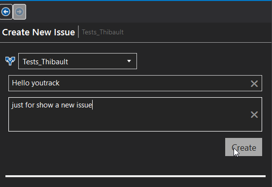

# Youtrack-for-visual-studio

[](https://www.guardrails.io)

 <a href="https://marketplace.visualstudio.com/items?itemName=Doods.Youtrack-for-visual-studio">
    
 
## Overview

Visual Studio YouTrack Extension is a plugin for Visual Studio integration with Youtrack.
It's beta version
I have shamelessly taken the code of the Bitbucket extension, there may be leftovers.

## Donate via PayPal


<a href="https://www.paypal.com/cgi-bin/webscr?cmd=_s-xclick&hosted_button_id=LUPRWJZ482856">
  
</a>

## Getting Started

### Prerequisites

Visual Studio 2015/2017 installed.

### Installing

Go to [Visual Studio Youtrack Extension](https://marketplace.visualstudio.com/items?itemName=Doods.Youtrack-for-visual-studio), download VSIX file and install it.
You can also install it from within Visual Studio. ```Tools -> Extensions and Updates```.
## Changes
24/04/2018 :
Now, we can create an issue

09/04/2018 : 
Fix error Login exception - remote name see : https://github.com/doodz/Youtrack-for-visual-studio/issues/1

03/04/2018 :
Add intelisense on YouTrack issue windows
update tools
On login view you can click project for open issue or right click

## Tools

## Screenshots




## Licence
