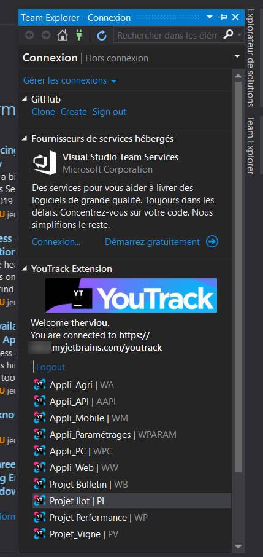
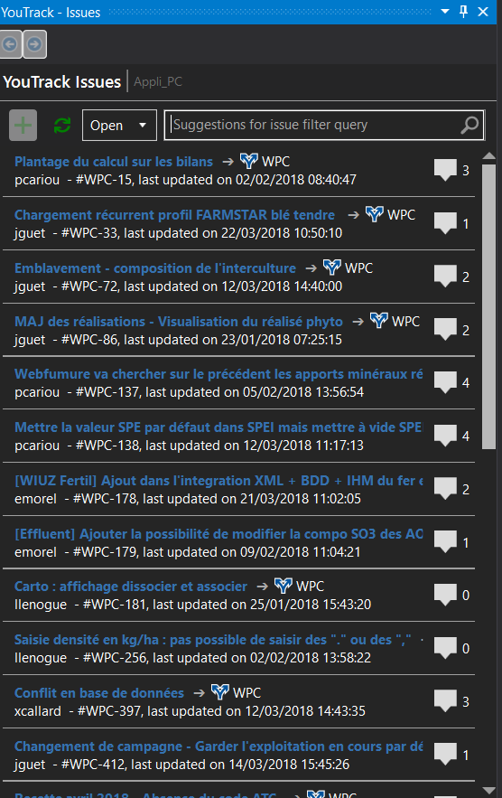

# Youtrack-for-visual-studio
 <a href="https://github.com/doodz/Youtrack-for-visual-studio">
    
<h2>Overview</h2>

Visual Studio YouTrack Extension is a plugin for Visual Studio integration with Youtrack.
It's beta version
I have shamelessly taken the code of the Bitbucket extension, there may be leftovers.

<h2>Changes</h2>
03/04/2018 :
Add intelisense on YouTrack issue windows
update tools
On login view you can click project for open issue or right click
<h2>Tools</h2>
<h2>Screenshots</h2>

<h2>Licence</h2>
